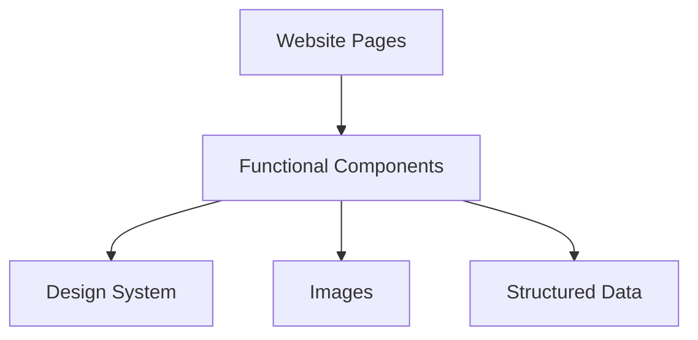

# Site Architecture

This project is a static website designed with performance as a top priority.

## Layers

---

**Structured data** lives in `src/data`. This folder does not contain all data, but mainly the core racePageData object and some shared variables related to navigation. For example, FAQ content (a set of questions and answers) is not considered structured data. All structured data is safely validated and parsed using Zod.

**Images** are kept in `src/images`. These assets are consumed primarily by functional components.

**Design system** components are located in `src/ui`. These are base, purely presentational components, independent of the website’s business logic. They enforce consistent styling across the website and improve maintainability. The structure follows Atomic Design principles.

**Functional components** are stored in `src/functional`, grouped by topic. These components handle the business-related content shown on the website by composing multiple pieces from the design system. They are used by the website page.

**Website pages** are defined in `src/pages`. As per Astro’s architecture, this directory is responsible for routing and assembling the final pages.

## Anatomy of a component

🏗️ WIP

- use `cva` to make sure all tw classes are included in the bundle

