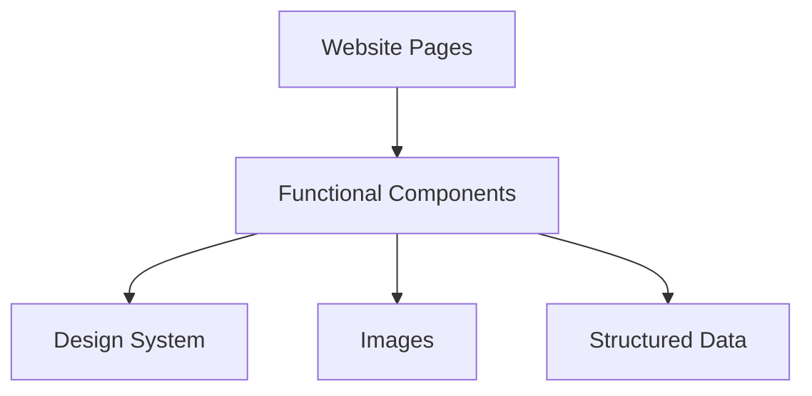

# Site Architecture

This project is a **static** website designed with performance and SEO as a top priority.

## Layers



---

**Structured data** lives in `src/data`. This folder does not contain all data, but mainly the core `racePageData` object and some shared variables related to navigation. For example, FAQ content (a set of questions and answers) is not considered structured data because of its simplicity. All structured data is safely validated and parsed using Zod.

**Images** are kept in `src/images`. These assets are consumed only by functional components.

**Design system** components are located in `src/components/ui`. These are base, purely presentational components, independent of the website’s business logic. They enforce consistent styling across the website and improve maintainability. The structure follows Atomic Design principles.

**Functional components** are stored in `src/components/functional`, grouped by topic. These components handle the business-related content shown on the website by composing multiple pieces from the design system. They are used by website pages.

**Website pages** are defined in `src/pages`. As per Astro’s architecture, this directory is responsible for routing and assembling the final pages.

## Anatomy of a component

### use `cva` to create Tailwind classes variants

Every conditional rendering on tailwind classes should be done via [`cva`](https://cva.style/docs) as it make sure all possible classes are included in the bundle.

Considering this example:

```typescript
const { gap } = Astro.props;

const gapClass = `gap-${gap}`;
```

Astro will not be able to guess what possible value `gap` can have, so no tailwind class will be included in the bundle.

### `className` as extra class props

use `className` to pass additional tailwind classes.

```typescript
interface Props {
  className?: string;
}
```

### use `cx` to merge all component classes

Since we're using `cva`, it's not expensive to use `cx` when merging multiples classes.

Astro's native `class:list` could also be used, but having this dealt with in the JS part improve readability.

`Flex` component example

```typescript
import { cva, type VariantProps, cx } from "class-variance-authority";

const flex = cva("flex", {
  variants: {
    // ...
  },
});

type Variants = VariantProps<typeof flex>;

interface Props extends Variants {
  className?: string;
  renderAs?: HTMLTag;
}

const { myVariant, className } = Astro.props;

const flexClasses = cx(flex({ myVariant }), className);
```

Note: `className` props should **not** be used with `cva` definition as it mix everything together (static and dynamic classes). Having only static classes in `cva` improve readability, especially when looking for conflicting classes.

### always type props with interface

as mentioned [here](https://docs.astro.build/en/guides/typescript/#component-props)

this should be positioned before props destructuring to improve readability.

### use `renderAs` for HTML tag props

it seems natural to use `as` when naming the props to provide a way to use a different HTML tag for a component, but this name breaks the build ([source](https://github.com/withastro/compiler/issues/927)).

use `renderAs` instead.
